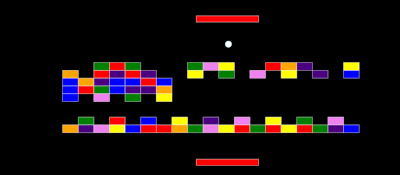

# Typescript Pong

Basic pong / brickbreaker in Typescript, WebPack, HTML Canvas.



Set up:

```sh
npm run install
```

Run:

```sh
npm run serve
```

Then navigate to this URL in your browser:

```sh
http://localhost:8080/dist/
```

